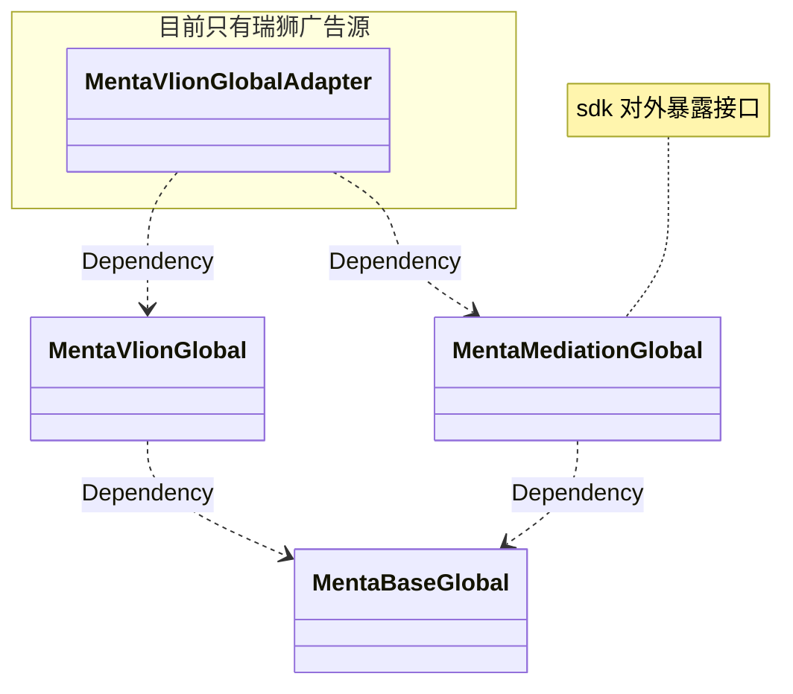
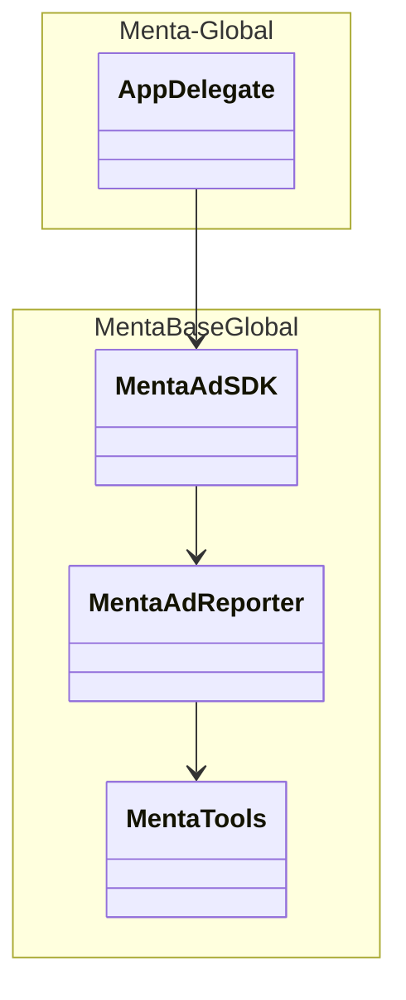
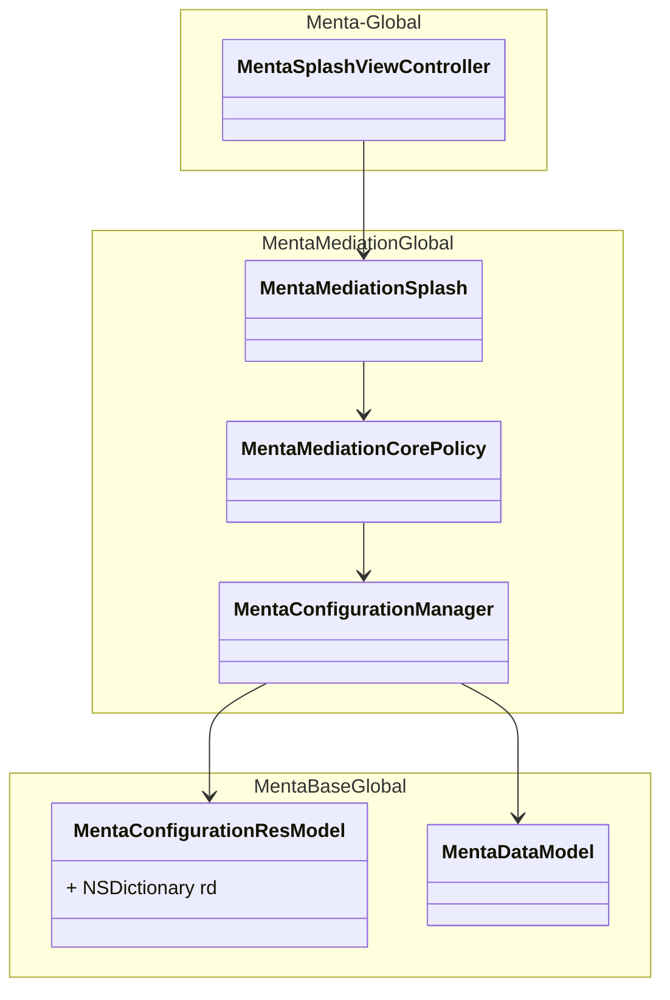
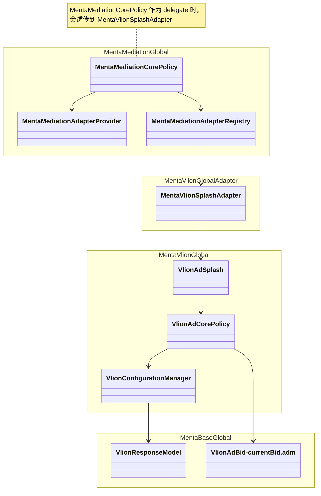
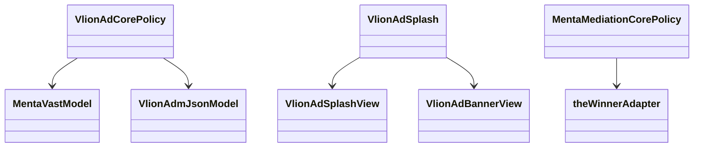
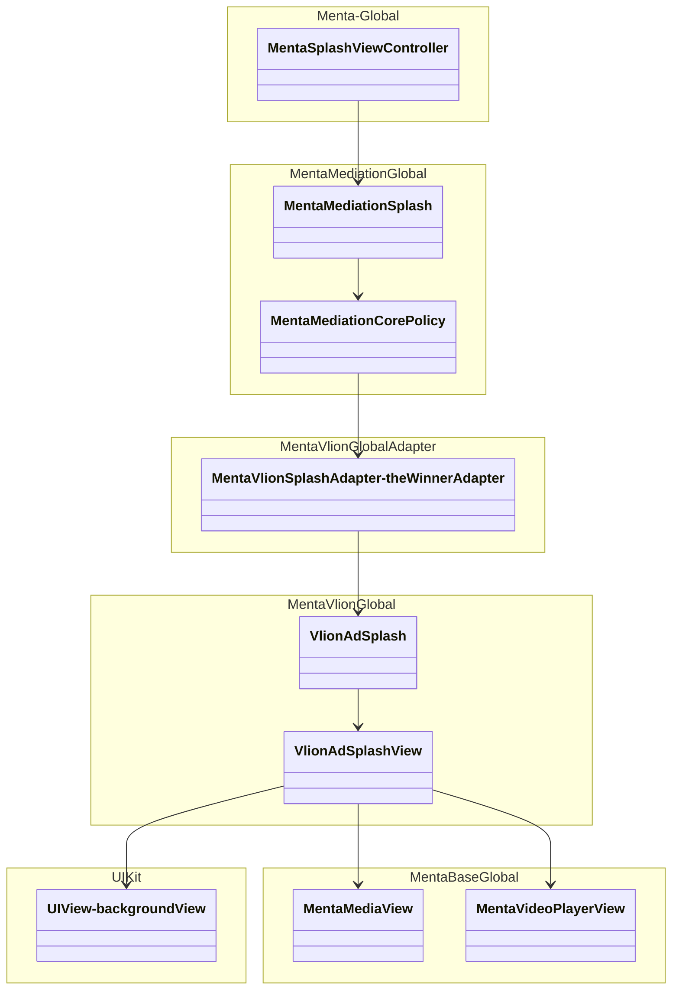

[TOC]

## 仓库依赖关系图

---

## 一、APP 启动，sdk 初始化，打点上报接口

打点：
1. https://sg-td-menta-01-callback.advlion.com/v1/batch

---

## 二、点击加载广告

### 2.1 拉取 menta 广告位配置数据

广告位配置数据：
1. https://api-v3-sg.mentamob.com/api/v1/config

---

### 2.2 创建配置适配器 多个竞价方发起竞价

发起竞价：
1. https://bid2.advlion.com/main?posId=5671&isdebug=1（开发包）
2. https://adx-saas.advlion.com/main?posId=5668（商店包）

---

### 2.3 开始预渲染：解析广告素材 提前创建广告视图

---

## 三、展示广告

1. https://tk2.advlion.com/win
2. https://tk2.advlion.com/imp

