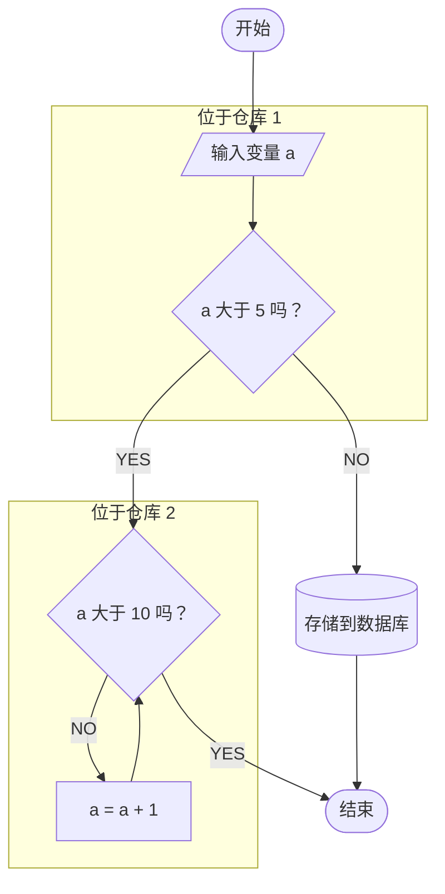
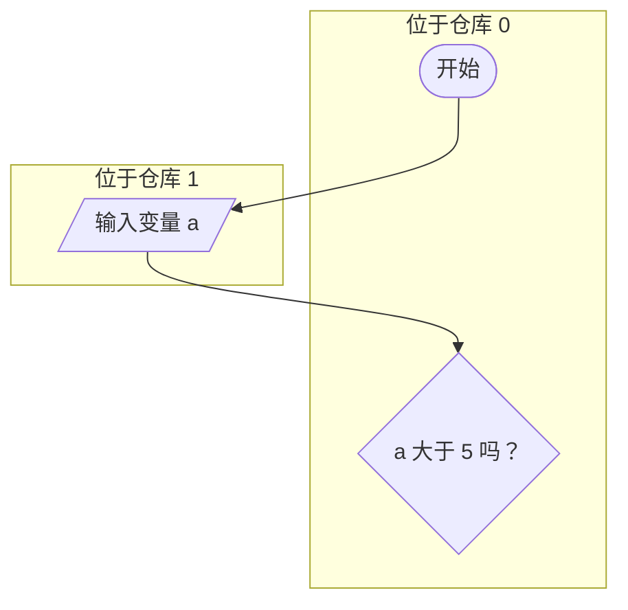
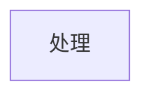
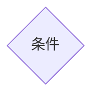
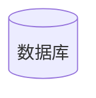

```mermaid
graph TD
    a([开始]) --> b[/输入变量 a/]
    subgraph 位于仓库 1
    b --> c{a 大于 5 吗？}
    end
    c -->|NO| d[(存储到数据库)]
    c -->|YES| e{a 大于 10 吗？}
    d --> f([结束])
    e -->|YES| f([结束])
    subgraph 位于仓库 2
    e -->|NO| g[a = a + 1]
    end
    g --> e
```

```mermaid
graph TD
    subgraph 位于仓库 0
    a; c
    end
    subgraph 位于仓库 1
    b
    end

    a([开始]) --> b[/输入变量 a/]
    b --> c{a 大于 5 吗？}
```

## 开始/结束

```mermaid
graph TD
    %% 矩形 大圆角
    id([开始/结束])
```

## 输入/输出

```mermaid
graph TD
    %% 平行四边形
    id[/输入/输出/]
```

## 语句

```mermaid
graph TD
    %% 矩形
    id[处理]
```

```mermaid
graph TD
    %% 矩形 小圆角
    id(处理)
```

## 条件

```mermaid
graph TD
    %% 菱形
    id{条件}
```

```mermaid
graph TD
    %% 菱形
    id{{条件}}
```

## 数据库

```mermaid
graph TD
    %% 数据库
    id[(数据库)]
```
