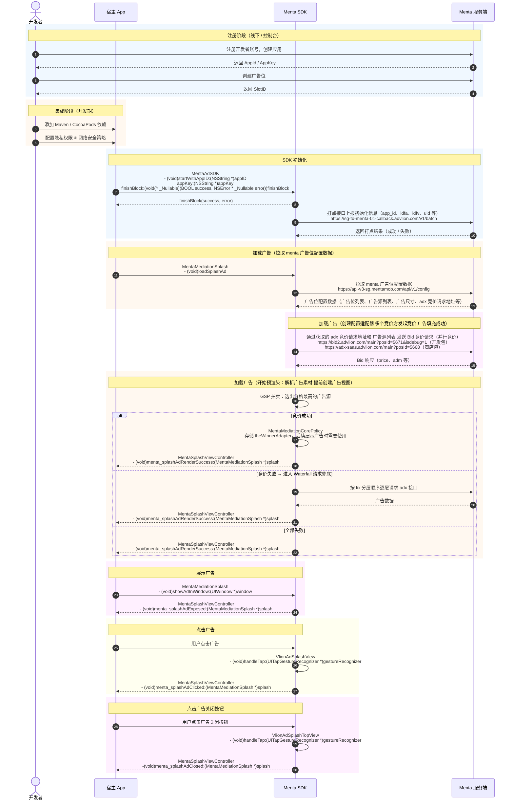

```mermaid
sequenceDiagram
    autonumber
    actor Dev as 开发者
    participant App as 宿主 App
    participant SDK as Menta SDK
    participant Srv as Menta 服务端

    %% 注册阶段
    rect rgb(240, 248, 255)
        note over Dev, Srv: 注册阶段（线下 / 控制台）
        Dev ->> Srv: 注册开发者账号，创建应用
        Srv -->> Dev: 返回 AppId / AppKey
        Dev ->> Srv: 创建广告位
        Srv -->> Dev: 返回 SlotID
    end

    %% 集成阶段
    rect rgb(255, 248, 240)
        note over Dev, App: 集成阶段（开发期）
        Dev ->> App: 添加 Maven / CocoaPods 依赖
        Dev ->> App: 配置隐私权限 & 网络安全策略
    end

    %% 初始化
    rect rgb(240, 248, 255)
        note over App, Srv: SDK 初始化
        App ->> SDK: MentaAdSDK <br> - (void)startWithAppID:(NSString *)appID <br> appKey:(NSString *)appKey <br> finishBlock:(void(^ _Nullable)(BOOL success,  NSError * _Nullable error))finishBlock
        SDK -->> App: finishBlock(success, error)
        SDK ->> Srv: 打点接口上报初始化信息（app_id、idfa、idfv、uid 等） <br> https://sg-td-menta-01-callback.advlion.com/v1/batch
        Srv -->> SDK: 返回打点结果（成功 / 失败）
    end

    %% 加载广告
    rect rgb(255, 248, 240)
        note over App, Srv: 加载广告（拉取 menta 广告位配置数据）
        App ->> SDK: MentaMediationSplash<br>- (void)loadSplashAd
        SDK ->> Srv: 拉取 menta 广告位配置数据<br>https://api-v3-sg.mentamob.com/api/v1/config
        Srv -->> SDK: 广告位配置数据（广告位列表、广告源列表、广告尺寸、adx 竞价请求地址等）
    end

    rect rgb(255, 240, 255)
        note over SDK, Srv: 加载广告（创建配置适配器 多个竞价方发起竞价 广告填充成功）
        SDK ->> Srv: 通过获取的 adx 竞价请求地址和 广告源列表 发送 Bid 竞价请求（并行竞价）<br>https://bid2.advlion.com/main?posId=5671&isdebug=1（开发包）<br>https://adx-saas.advlion.com/main?posId=5668（商店包）
        Srv -->> SDK: Bid 响应（price、adm 等）
    end

    rect rgb(255, 248, 240)
        note over App, Srv: 加载广告（开始预渲染：解析广告素材 提前创建广告视图）
        SDK ->> SDK: GSP 拍卖：选出价格最高的广告源
        alt 竞价成功
            SDK ->> SDK: MentaMediationCorePolicy <br> 存储 theWinnerAdapter，后续展示广告时需要使用
            SDK -->> App: MentaSplashViewController <br> - (void)menta_splashAdRenderSuccess:(MentaMediationSplash *)splash
        else 竞价失败 → 进入 Waterfall 请求兜底
            SDK ->> Srv: 按 fix 分层顺序逐层请求 adx 接口
            Srv -->> SDK: 广告数据
            SDK -->> App: MentaSplashViewController <br> - (void)menta_splashAdRenderSuccess:(MentaMediationSplash *)splash
        else 全部失败
            SDK -->> App: MentaSplashViewController <br> - (void)menta_splashAdRenderSuccess:(MentaMediationSplash *)splash
        end
    end

    %% 展示广告
    rect rgb(255, 240, 255)
        note over App, SDK: 展示广告
        App ->> SDK: MentaMediationSplash <br> - (void)showAdInWindow:(UIWindow *)window
        SDK -->> App: MentaSplashViewController <br> - (void)menta_splashAdExposed:(MentaMediationSplash *)splash
    end

    %% 点击广告
    rect rgb(255, 255, 240)
        note over App, SDK: 点击广告
        App ->> SDK: 用户点击广告
        SDK ->> SDK: VlionAdSplashView <br> - (void)handleTap:(UITapGestureRecognizer *)gestureRecognizer
        SDK -->> App: MentaSplashViewController <br> - (void)menta_splashAdClicked:(MentaMediationSplash *)splash
    end

    %% 点击广告关闭按钮
    rect rgb(255, 240, 255)
        note over App, SDK: 点击广告关闭按钮
        App ->> SDK: 用户点击广告关闭按钮
        SDK ->> SDK: VlionAdSplashTopView <br> - (void)handleTap:(UITapGestureRecognizer *)gestureRecognizer
        SDK -->> App: MentaSplashViewController <br> -(void)menta_splashAdClosed:(MentaMediationSplash *)splash
    end
```