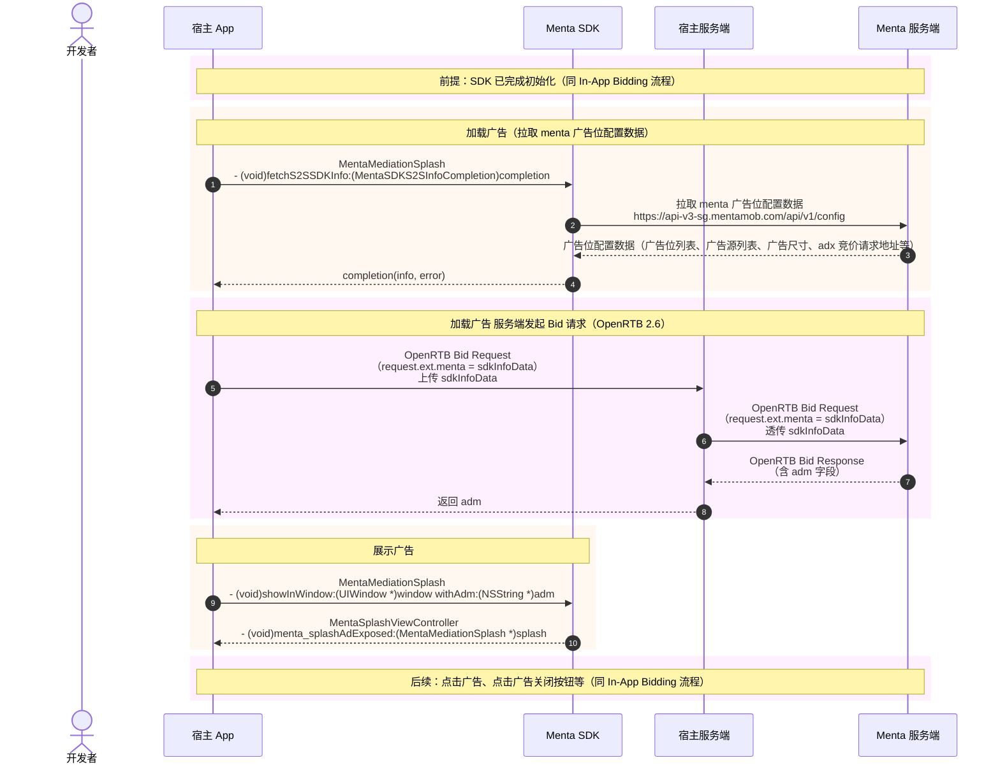

```mermaid
sequenceDiagram
    autonumber
    actor Dev as 开发者
    participant App as 宿主 App
    participant SDK as Menta SDK
    participant HostSrv as 宿主服务端
    participant Srv as Menta 服务端

    rect rgb(255, 240, 255)
        note over App, Srv: 前提：SDK 已完成初始化（同 In-App Bidding 流程）
    end

    %% 加载广告
    rect rgb(255, 248, 240)
        note over App, Srv: 加载广告（拉取 menta 广告位配置数据）
        App ->> SDK: MentaMediationSplash <br> - (void)fetchS2SSDKInfo:(MentaSDKS2SInfoCompletion)completion
        SDK ->> Srv: 拉取 menta 广告位配置数据<br>https://api-v3-sg.mentamob.com/api/v1/config
        Srv -->> SDK: 广告位配置数据（广告位列表、广告源列表、广告尺寸、adx 竞价请求地址等）
        SDK -->> App: completion(info, error)
    end

    rect rgb(255, 240, 255)
        note over App, Srv: 加载广告 服务端发起 Bid 请求（OpenRTB 2.6）
        App ->> HostSrv: OpenRTB Bid Request<br>（request.ext.menta = sdkInfoData）<br>上传 sdkInfoData
        HostSrv ->> Srv: OpenRTB Bid Request<br>（request.ext.menta = sdkInfoData）<br>透传 sdkInfoData
        Srv -->> HostSrv: OpenRTB Bid Response<br>（含 adm 字段）
        HostSrv -->> App: 返回 adm
    end

    %% 展示广告
    rect rgb(255, 248, 240)
        note over App, SDK: 展示广告
        App ->> SDK: MentaMediationSplash <br> - (void)showInWindow:(UIWindow *)window withAdm:(NSString *)adm
        SDK -->> App: MentaSplashViewController <br> - (void)menta_splashAdExposed:(MentaMediationSplash *)splash
    end

    rect rgb(255, 240, 255)
        note over App, Srv: 后续：点击广告、点击广告关闭按钮等（同 In-App Bidding 流程）
    end
```