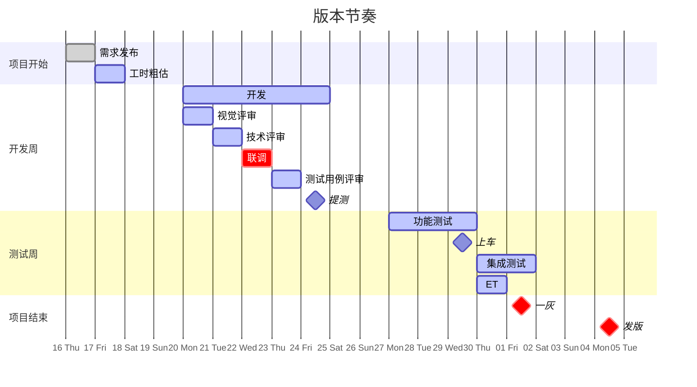

```mermaid
gantt
    title 版本节奏

    %% 起止日期语法格式
    dateFormat YYYY-MM-DD
    %% 最下方时间轴日期格式
    %% axisFormat %m-%d
    axisFormat %d %a
    %% 最下方时间轴时间间隔
    tickInterval 1day
    %% 表示今天标记的显示样式
    %% todayMarker off
    todayMarker stroke-width:3px, stroke:#FBBC05, opacity:0.6

    %% 定义任务分类
    %% 任务名: 状态, 任务标识（可省略）, 开始时间, 持续时间/结束时间

    section 项目开始
    需求发布: done, a0, 2026-04-16, 1d
    工时粗估: active, a1, after a0, 1d

    section 开发周
    开发: active, a2, 2026-04-20, 5d
    视觉评审: active, a3, 2026-04-20, 1d
    技术评审: active, a31, 2026-04-21, 1d
    联调: crit, a4, 2026-04-22, 2026-04-23
    测试用例评审: active, a5, 2026-04-23, 1d
    提测: milestone, a6, 2026-04-24, 1d

    section 测试周
    功能测试: active, a7, 2026-04-27, 3d
    上车: milestone, a8, 2026-04-29, 1d
    集成测试: active, a9, after a8, 2d
    ET: active, a10, after a8, 1d

    section 项目结束
    一灰: crit, milestone, a11, 2026-05-01, 1d
    发版: crit, milestone, 2026-05-04, 1d
```
